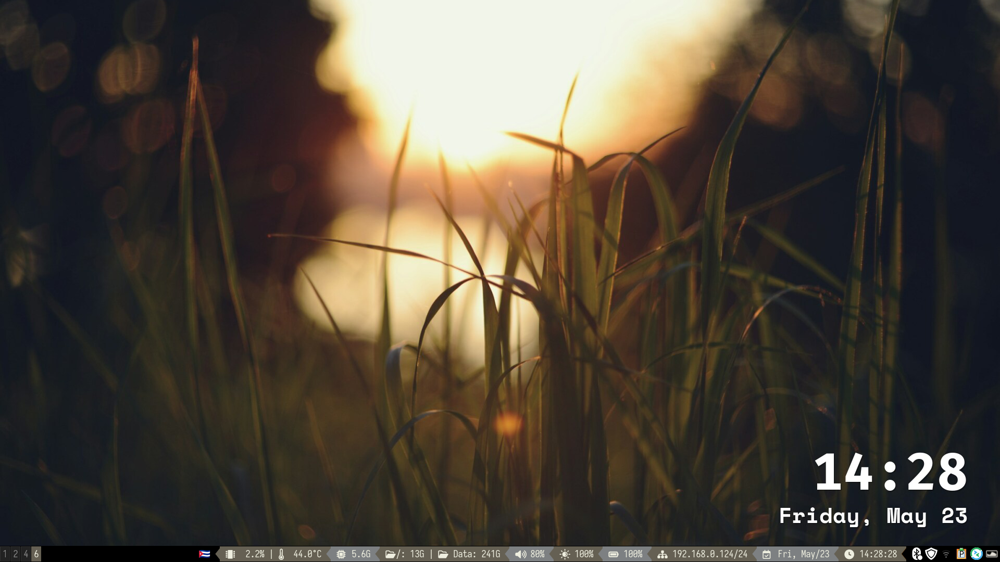
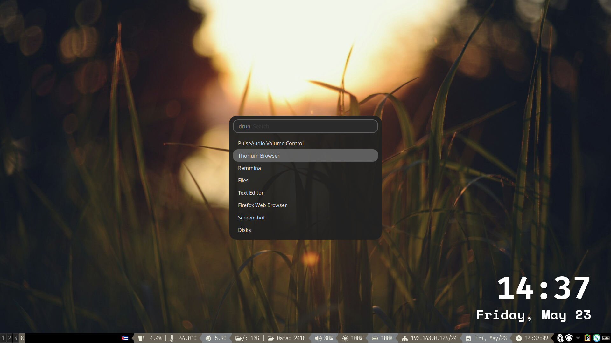

These are my i3 window manager configs in Ubuntu

# Requirements

```bash
sudo apt install i3 picom feh rofi dunst parcellite arc-theme sway
```

```bash
pip3 install wal
```

# Usage

- Put the contents of **config** directory, into your **~/.config/**.

- Put the directory **rofi** into **~/.config/** too.

- Put the **fonts** into **~/.fonts/**.

- Put an image file in **~/Pictures/** named **background.jpg**.

- Put the **gtkrc-2.0** file in $HOME with the name **.gtkrc-2.0**.

- Put the **config/gtk-3.0** directory in **~/.config/**.

# Screenshots





# Notes in colorscheme

- The colorscheme is generated by **wal**. You can change the colorscheme by changing the image in **~/Pictures/background.jpg** and running `wal -i ~/Pictures/background.jpg`.

- The colorscheme is applied to i3, rofi, dunst, and gtk3.

This way, we get a dynamic colorscheme that changes with the wallpaper every time we call `wal`.