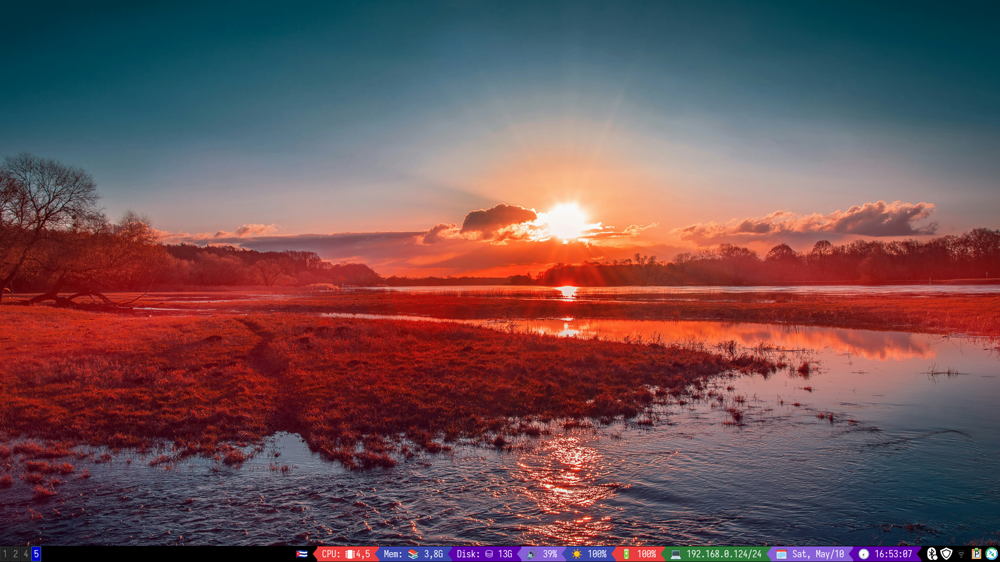

These are my i3 window manager configs in Ubuntu

# Requirements

```bash
sudo apt install i3 picom feh rofi dunst parcellite arc-theme sway
```

# Usage

- Put the contents of **config** directory, into your **~/.config/**.

- Put the directory **rofi** into **~/.config/** too.

- Put the **fonts** into **~/.fonts/**.

- Put an image file in **~/Pictures/** named **background.jpg**.

- Put the **gtkrc-2.0** file in $HOME with the name **.gtkrc-2.0**.

- Put the **config/gtk-3.0** directory in **~/.config/**.

# i3 gaps workaround

If you wish having gaps between windows:

- Make a copy of your current running i3 executable.

- Search any **Regolith** repo and download the **i3-gaps-wm** DEB.

- Unzip the DEB file, and copy the **i3** executable in **/usr/bin/**.

- Close the session and enter again.

# Screenshots


